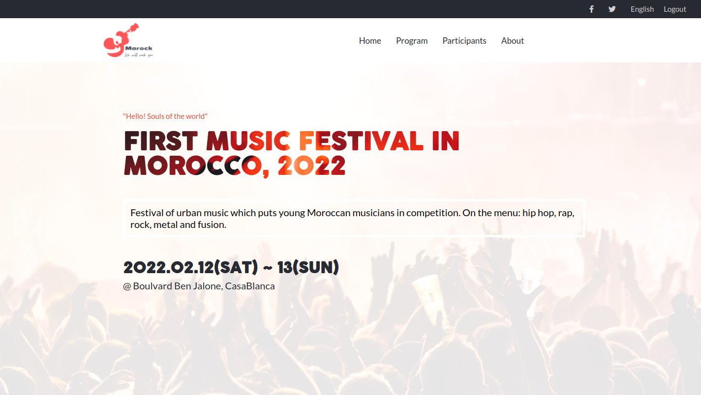
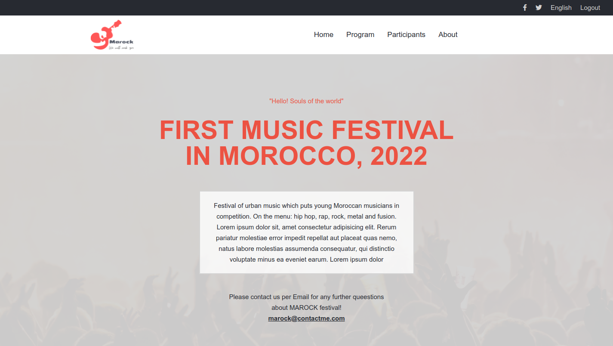
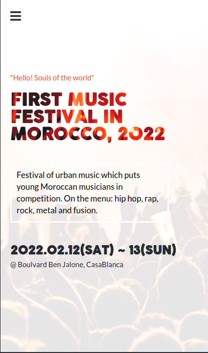

# Marock Music Festival

> This project was built with a Mobile-first design perspective and it's mobile responsive. for the design, the main technologies in CSS are flexbox and media query. The Festival was inspired by the boulevard urban music festival in morocco

## Screenshot

## Built With

- HTML
- CSS
- FlexBox
- Grid
- JavaScript
- Github Pages

## Live Demo

[Live Demo Link](https://ismailco.github.io/First-capstone-project_Conference-page/)

## Getting Started

To get a local copy up and running follow these simple example steps.

- copy the repo URL
- $ git clone (repo URL)

## Author

- GitHub: [@ismailco](https://github.com/Ismailco)
- Twitter: [@ismailcourr](https://www.twitter.com/ismailcourr)
- LinkedIn: [ismailcourr](https://www.linkedin.com/in/ismailcourr/)
- My Website: [ismailcourr.ml](https://www.ismailcourr.ml)

## Acknowledgments

- This project is based on the design guidelines creative commons license design. The Original design idea by [Cindy Shin in Behance.](https://www.behance.net/adagio07)
- The ccl design was the inspiration in the creative and artistic side of the project, I got inspired by l'boulvar urban music festival to build this website.

## 🤝 Contributing

if you have any ideas to add to the project Please let me know, you can create an issue.

## Show your support

Give a ⭐️ if you like this project!
